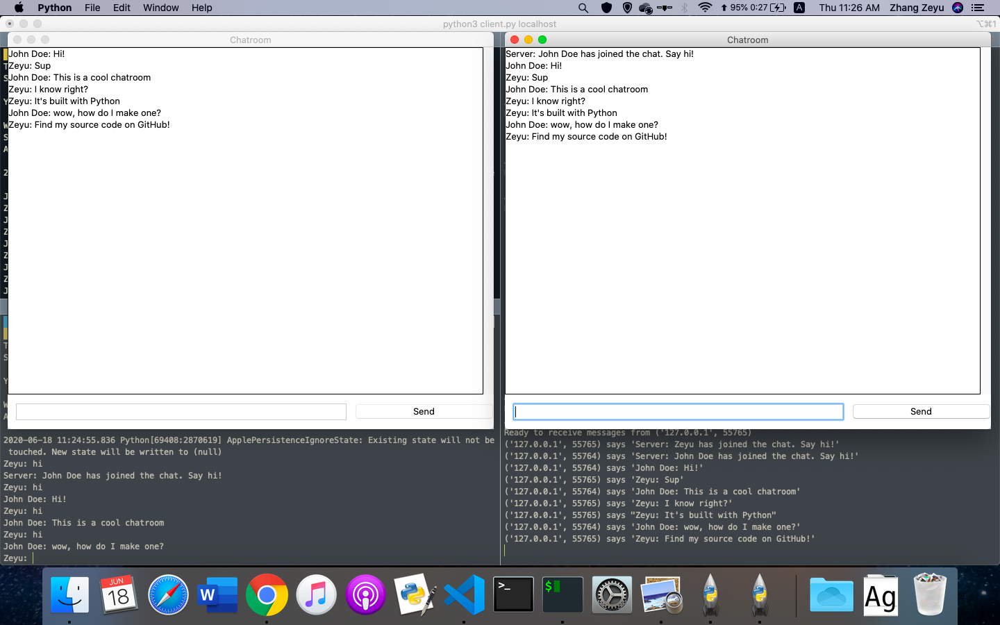
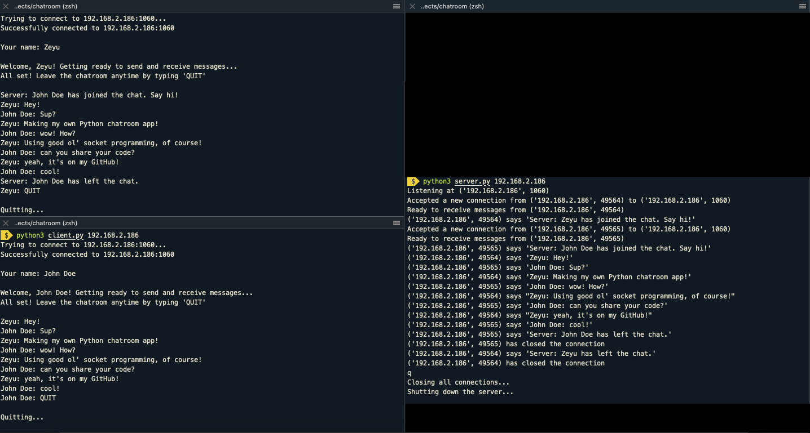

# pychat
 A Python chatroom application with Tkinter GUI

## Create Your Own Chatroom Application
Check out my tutorial [here](https://dev.to/zeyu2001/build-a-chatroom-app-with-python-44fa).

## How to Run? 
Run the `server.py` script from the command line. 

Usage: ```python3 server.py <host> [-p PORT]```

Arguments:
- ```host```: Interface the server listens at. Can be a hostname, or an IP address.
- ```-p PORT```: TCP port the server listens at (default 1060)

For example:

```bash
$ python3 server.py 127.0.0.1
Listening at ('127.0.0.1', 1060)
```

```bash
$ python3 server.py localhost
Listening at ('127.0.0.1', 1060)
```

Run the `client.py` script from the command line (in a separate terminal window). 

Usage: ```python3 client.py <host> [-p PORT]```

Arguments:
- ```host```: Interface the server listens at. Can be a hostname, or an IP address.
- ```-p PORT```: TCP port the server listens at (default 1060)

For example:

```bash
$ python3 client.py localhost
Trying to connect to localhost:1060...
Successfully connected to localhost:1060

Your name:
```

```bash
$ python3 client.py 127.0.0.1
Trying to connect to 127.0.0.1:1060...
Successfully connected to 127.0.0.1:1060

Your name:
```

Run multiple clients to chat in real-time! 

Note: If connecting from a different subnet, your firewall may block the connection.

## Preview

### GUI Interface


### Command Line Interface
